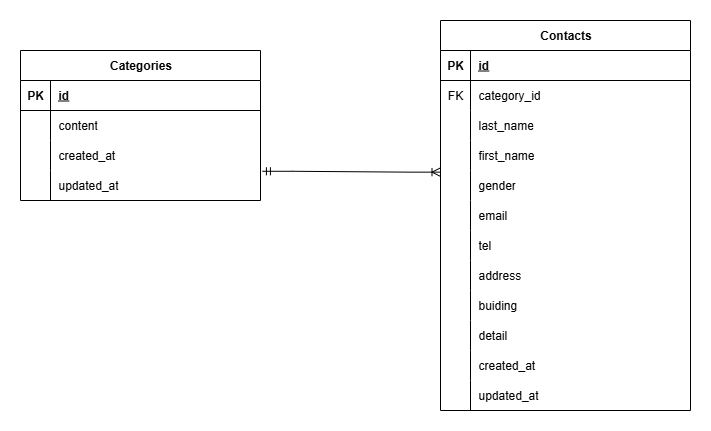

# アプリケーション名

ContactFormApp

## 概要

- ショップ利用ユーザー対象のお問い合わせフォーム機能
- ログイン済み管理者による問い合わせデータ管理機能

## 環境構築

### Docker ビルド

1. git clone

- SSH の場合
  git@github.com:e-kasai/exam1.git
- HTTPS の場合
  https://github.com/e-kasai/exam1.git

2. cd exam1
3. docker-compose up -d --build

### Laravel 環境構築

1. docker-compose exec php bash
2. composer install
3. cp .env.example .env
4. .env ファイル編集（Laravel 演習講座お問い合わせフォームの章の設定内容と同様でお願いします）
5. php artisan key:generate
6. php artisan migrate
7. php artisan db:seed

### 環境依存について

環境によって MySQL コンテナが起動しない場合は docker-compose.yml の platform やポート設定を適宜調整してください。

## 使用技術

- Laravel 8.83.8
- PHP 8.1.33
- MySQL 8.0.26
- Docker/docker-compose

## ER 図

## URL

- 開発環境：http://localhost/
- phpMyAdmin：http://localhost:8080/

## ユーザー定義について

本アプリケーションにおける `users` テーブルは、管理画面よりすべてのお問い合わせを閲覧できる権限を持つため
実質的に「管理者アカウント」を意味すると解釈しました。
仕様によりテーブル名は `users` と明記されているため、本実装では以下の設計で開発を行っています。

- users = 一般ユーザーではなく管理者アカウント（すべてのお問い合わせ内容の閲覧・検索が可能）
- お問い合わせフォームの view 仕様に「ログアウトボタンがない」ことからフォームは誰でも利用可能（認証不要）

以上の前提をもとに、管理者ログインおよびお問い合わせ一覧の機能を実装しています。
この前提により、auth ミドルウェアは管理画面のみに適用しています。
